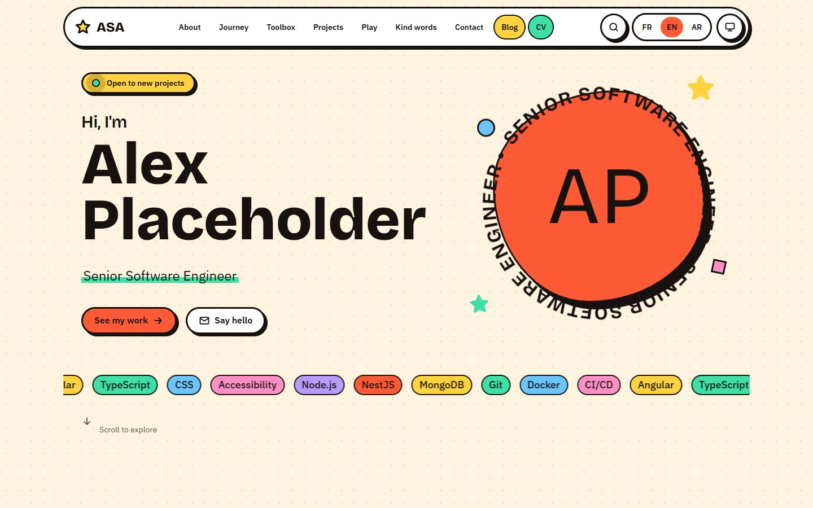
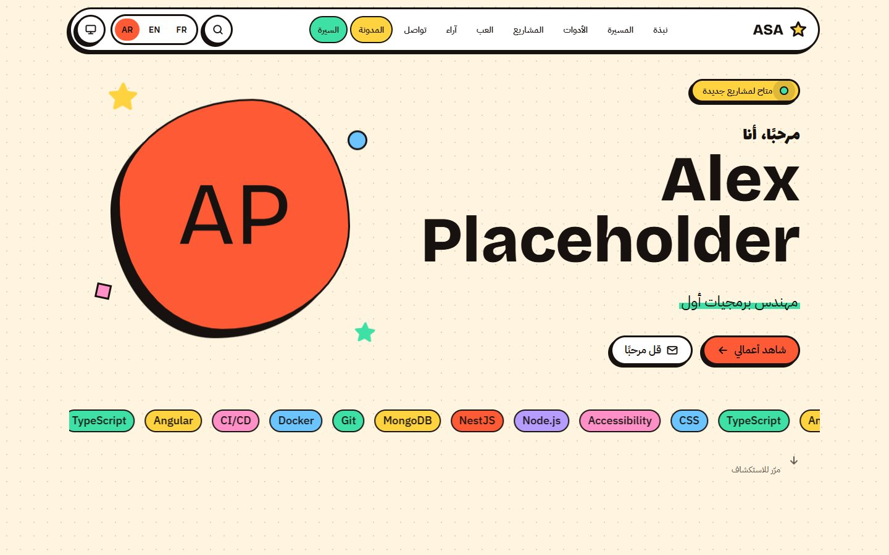
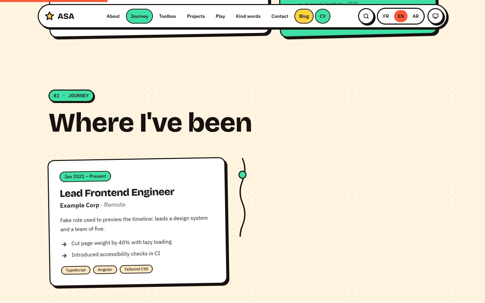
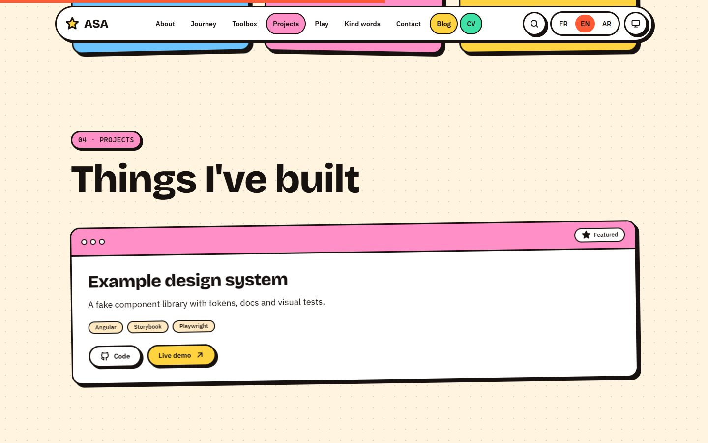
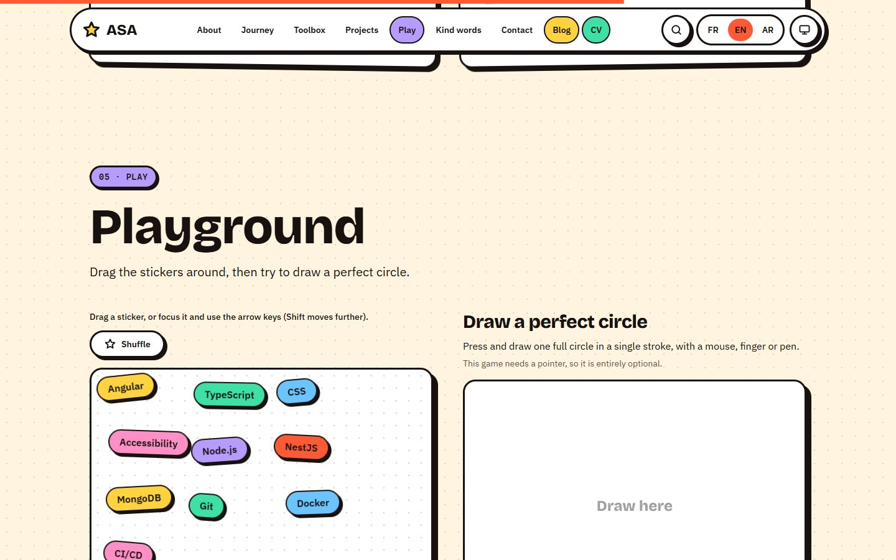
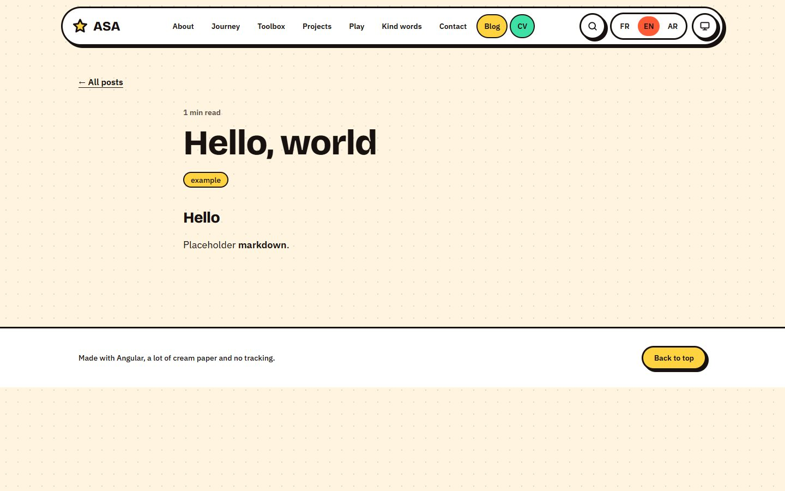
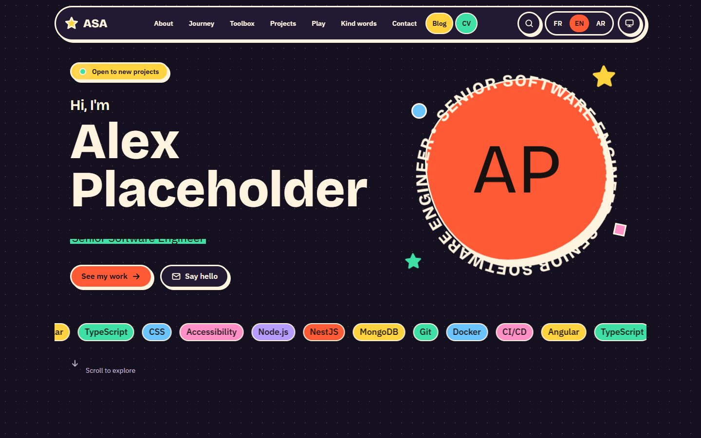
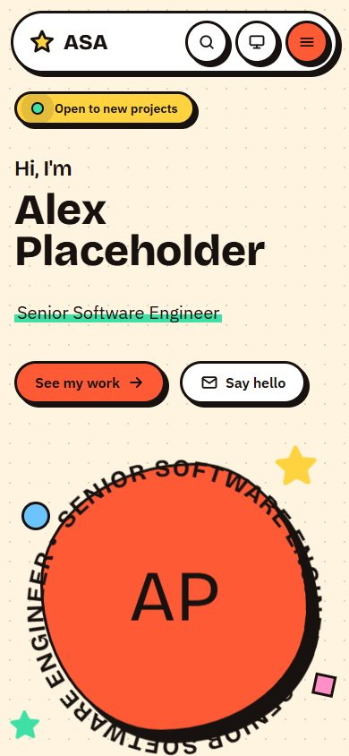
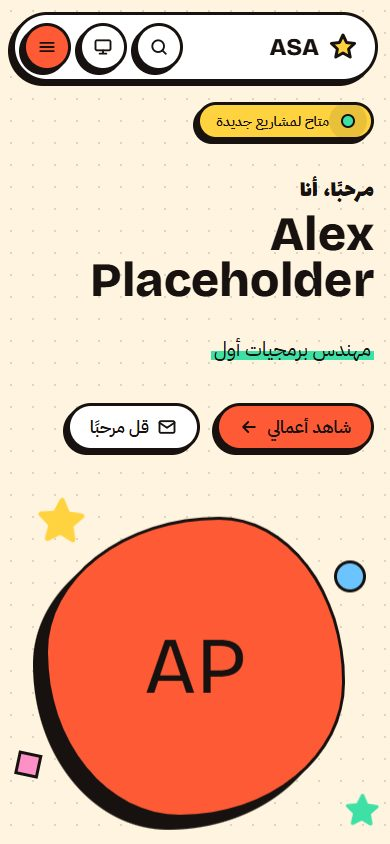
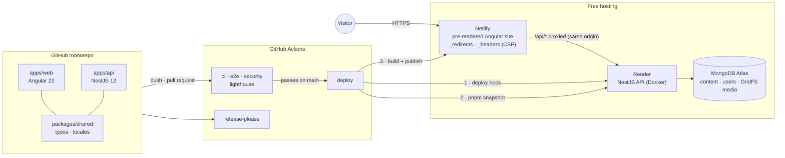

# ASA Portfolio

[](https://github.com/SofienAbdeddaim/asa-portfolio/actions/workflows/ci.yml)
[](https://github.com/SofienAbdeddaim/asa-portfolio/actions/workflows/e2e.yml)
[](https://github.com/SofienAbdeddaim/asa-portfolio/actions/workflows/security.yml)
[](LICENSE)

The personal portfolio of Sofien Abdeddaim, Senior Software Engineer: a trilingual site (**French, English and Arabic with true right-to-left layout**) with a private back-office, built as a showcase of architecture, security and delivery. It runs entirely on free services.

|                                    English                                     |                                      العربية (RTL)                                      |
| :----------------------------------------------------------------------------: | :-------------------------------------------------------------------------------------: |
|  |  |

<details>
<summary>More screenshots</summary>

| Timeline                                                                              | Projects                                                                           |
| ------------------------------------------------------------------------------------- | ---------------------------------------------------------------------------------- |
|  |  |

| Playground                                                                                                    | Blog                                                                       |
| ------------------------------------------------------------------------------------------------------------- | -------------------------------------------------------------------------- |
|  |  |

| Dark theme                                                                | Mobile                                                                                                                                                              |
| ------------------------------------------------------------------------- | ------------------------------------------------------------------------------------------------------------------------------------------------------------------- |
|  |   |

The screenshots show the clearly fake demo content that ships with the repository. Regenerate them with `pnpm build && pnpm screenshots`.

</details>

## Features

- **Three languages, one design.** Every text exists in French, English and Arabic (English is the fallback). Arabic is not a translation of the layout: it mirrors it, including shadows, tilts, slide-ins and icons, through logical CSS properties only (a lint rule forbids `left` and `right`).
- **A sticker-book identity** with motion that respects `prefers-reduced-motion`, a draggable-sticker playground and a draw-a-perfect-circle game, a Ctrl+K command palette, and a light and dark theme.
- **Private back-office** at `/admin`: mandatory two-factor sign-in, a generic editor for every kind of content with per-language fields and translation-completeness hints, drafts, drag or keyboard reordering, secure image upload, and a Markdown editor with sanitized preview.
- **Blog and CV.** Markdown posts, and a print-ready CV per language (browser print-to-PDF), all pre-rendered.
- **Works while the API sleeps.** The site is static and built from a snapshot of the published content, then refreshes itself from the API when it is awake.
- **SEO done properly:** per-language canonical and `hreflang` links, sitemaps, JSON-LD, localized 404s with a real 404 status.

## Architecture



- The browser only talks to one origin. Netlify forwards `/api/*` to the API, so the session cookie is first-party, `httpOnly` and `SameSite=Strict`, and no CORS is involved.
- The static pages are built from `GET /api/content` and the images it references (`pnpm snapshot`). On load, the page swaps in live content, so edits show up immediately and the pre-rendered HTML catches up on the next deploy.
- Why each choice was made: [docs/adr](docs/adr) (17 decision records).

## Stack

| Area      | Choice                                                                                                                                         |
| --------- | ---------------------------------------------------------------------------------------------------------------------------------------------- |
| Web       | Angular 22 (standalone, signals, OnPush, static prerender), Tailwind CSS 4, Transloco, `marked` + DOMPurify                                    |
| API       | NestJS 12 (ESM), Mongoose 9, argon2id, TOTP (`otpauth`), JWT access tokens with rotating refresh tokens, sharp, Helmet, rate limiting, Swagger |
| Data      | MongoDB (Atlas M0 free tier in production), GridFS for images                                                                                  |
| Workspace | pnpm workspaces, TypeScript 6 (strict), ESLint 10 + angular-eslint, Prettier, Vitest, Playwright, husky + commitlint                           |
| Delivery  | GitHub Actions, Netlify (site), Render (API), Dependabot, release-please                                                                       |

```
apps/web         Angular app            apps/api        NestJS API and CLI (seed, snapshot export)
packages/shared  types and locale rules e2e             Playwright suite, Lighthouse runner, test server
scripts          build tooling          docs            ADRs, plan, guides
```

## Run it locally

You need Node 24 (`.nvmrc`), pnpm (`corepack enable`) and Docker for MongoDB.

```bash
pnpm install
cp .env.example .env                   # then set JWT_SECRET, TOTP_ENCRYPTION_KEY, SEED_ADMIN_* (see the comments)
docker compose up -d mongo
pnpm --filter @asa/api seed:admin      # the first admin (two-factor is set up at first sign-in)
pnpm --filter @asa/api seed:demo       # optional: clearly fake content
pnpm --filter @asa/api dev             # API on http://localhost:3000 (Swagger at /api/docs)
pnpm --filter @asa/web start           # site on http://localhost:4200, /api proxied to the API
```

Open <http://localhost:4200>. The back-office is at <http://localhost:4200/admin> ([how to use it](docs/BACKOFFICE.md)).

### Configuration

All API settings are validated at start-up; the process refuses to run with a missing or weak value. The template is [.env.example](.env.example).

| Variable                                            | Purpose                                                                           |
| --------------------------------------------------- | --------------------------------------------------------------------------------- |
| `MONGODB_URI`                                       | Database connection string                                                        |
| `CORS_ORIGIN`                                       | The site's origin; the only origin allowed to call state-changing endpoints       |
| `JWT_SECRET`                                        | At least 32 random characters                                                     |
| `TOTP_ENCRYPTION_KEY`                               | 32 random bytes, base64; encrypts two-factor secrets at rest                      |
| `COOKIE_SECURE`, `TRUST_PROXY_HOPS`                 | Cookie flag (true in production) and number of proxies in front of the API        |
| `SEED_ADMIN_EMAIL`, `SEED_ADMIN_PASSWORD`           | Used only by `seed:admin`                                                         |
| `API_URL`, `API_ORIGIN`, site URL (`pnpm site:url`) | Build time: where to fetch content, where `/api` is forwarded, the public address |

### Commands

| Command                                    | What it does                                                  |
| ------------------------------------------ | ------------------------------------------------------------- |
| `pnpm lint` · `format:check` · `typecheck` | The static gates (lint includes the RTL-safety check)         |
| `pnpm test`                                | Script, API and web tests; 70% coverage is enforced           |
| `pnpm build`                               | API, shared package and the pre-rendered site                 |
| `pnpm e2e`                                 | Playwright against the built stack ([guide](docs/TESTING.md)) |
| `pnpm lighthouse`                          | Performance, accessibility, best-practice and SEO budgets     |
| `pnpm snapshot`                            | Pull the published content and images into the site           |
| `pnpm screenshots`                         | Regenerate the images above                                   |
| `pnpm --filter @asa/api admin` / `backup`  | Account recovery, and backup and restore of the content       |

## Quality and security

- **Gates on every pull request:** commit and title lint, format, lint, types, unit and API tests with coverage thresholds, the production build, a Docker build of the API, end-to-end tests in a real browser against a real database, CodeQL, dependency review, `pnpm audit`, a scan of the API container image, and a secret scan of the whole history. Lighthouse runs on web changes. `main` accepts only squash-merged pull requests that pass them ([rules](docs/BRANCH_PROTECTION.md)).
- **Authentication:** argon2id passwords; two-factor (TOTP) is mandatory and enrolled at first sign-in, secrets encrypted at rest, ten single-use recovery codes stored as keyed hashes; 15-minute access tokens and rotating refresh tokens with reuse detection and a 30-day limit, both in `httpOnly` cookies and never in web storage; separate lockouts for wrong passwords and wrong codes, plus rate limits ([ADR 8](docs/adr/0008-authentication-design.md)).
- **Hardening:** strict CSP with per-script hashes (no `unsafe-inline` for scripts), HSTS and friends, origin checks on every state-changing request, validated input, uploads decoded and re-encoded (never stored as sent), Markdown sanitized wherever it is rendered, private responses never cached, a non-root container with no package managers. The review, the threats, and the risks that remain are in [docs/SECURITY.md](docs/SECURITY.md) and [ADR 18](docs/adr/0018-hardening.md); black-box probes of the running stack are part of the test suite.
- **Recovery and backups:** a lost authenticator or password is recovered from a machine with database access (`admin` command), never over the web; the free database has no backups, so `backup export` and `backup import` save and restore everything the back-office holds, drafts and images included ([guide](docs/DEPLOYMENT.md#backups-and-recovery)).
- **Supply chain:** actions pinned by commit, least-privilege tokens (the deploy token reaches only the publish step), Dependabot, no secrets or default credentials in the repository. Report a vulnerability through [SECURITY.md](SECURITY.md).
- **Accessibility:** WCAG 2.2 AA enforced by axe-core on every page, language and theme, and on the back-office; keyboard-operable everything (including the sticker playground and reordering) with visible focus and no traps; focus moves to the new heading after a page change and language switches are announced; reflow at 320 px; Lighthouse accessibility is 100 on every page.
- **Performance:** Lighthouse on mobile scores 93 to 97 on five of the six measured pages and 85 on the Arabic home page (its typography needs about 140 KB of fonts). Below-the-fold sections hydrate when they are about to be seen. How it is measured and what was changed: [ADR 18](docs/adr/0018-hardening.md).

## Deploying

Every push to `main` that passes CI deploys by itself; pull requests that touch the web app get a preview site. The one-time setup (about 30 minutes, no card expected) is in [docs/DEPLOYMENT.md](docs/DEPLOYMENT.md).

Free-tier realities worth knowing up front:

- **The API sleeps after 15 idle minutes** on Render's free plan and takes about a minute to wake. Visitors do not feel it (the site is static); the back-office does. An optional keep-warm workflow can ping it.
- **Netlify's free plan allows about 20 production deploys a month** (a credit budget with a hard limit), so changes are batched through pull requests.
- **Atlas M0** holds 512 MB and pauses after 30 days without a connection.

## Documentation

[PLAN](docs/PLAN.md) (phases and status) · [ADRs](docs/adr) · [Back-office guide](docs/BACKOFFICE.md) · [Deployment](docs/DEPLOYMENT.md) · [Testing](docs/TESTING.md) · [Security](docs/SECURITY.md) · [Branch protection](docs/BRANCH_PROTECTION.md) · [Design concepts](docs/CONCEPTS.md) · [Contributing](CONTRIBUTING.md) · [Security policy](SECURITY.md) · [API](apps/api/README.md) · [Web](apps/web/README.md)

## Status

All phases of the plan are done ([docs/PLAN.md](docs/PLAN.md)). What is left is yours to do: create the accounts, set the secrets and variables, and run the first deploy ([docs/DEPLOYMENT.md](docs/DEPLOYMENT.md)); the workflows, the deployment path and the release automation have been checked by linting and by running the pieces locally, but not yet on GitHub or the hosts.

## License

[MIT](LICENSE)
