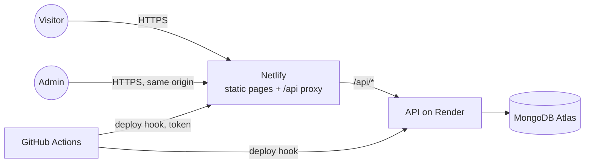

# Security

What is protected, from whom, how, and what is knowingly left open. The reasoning behind the main choices is in [ADR 8](adr/0008-authentication-design.md) (authentication), [ADR 16](adr/0016-seo-and-content-pipeline.md) (what is public) and [ADR 18](adr/0018-hardening.md) (the Phase 7 review). To report a problem, see [SECURITY.md](../SECURITY.md) at the root.

## What there is to protect

| Asset                                                                  | Who might want it                                          | Worst case                                                |
| ---------------------------------------------------------------------- | ---------------------------------------------------------- | --------------------------------------------------------- |
| The admin account (content, uploads)                                   | anyone on the internet                                     | the site is defaced, or made to serve scripts to visitors |
| Visitors' browsers                                                     | someone who can get content onto the site                  | stored XSS through a post, an image, or a profile field   |
| The drafts and unpublished entries                                     | scrapers, curious visitors                                 | private writing published early                           |
| The secrets (JWT key, encryption key, database and deploy credentials) | anyone who reads a repository, a log, or a leaked database | account takeover; a malicious deployment                  |
| Availability of the site                                               | anyone with a script                                       | the pages are static, so a flood only hurts the API       |

There is no payment data, no visitor accounts and no personal data about visitors: the site sets no cookie for them and runs no analytics.

## How the pieces are exposed

Only two things are reachable from the internet: the static site, and the API (through the site's `/api`, and also directly at its own address). The database accepts connections from anywhere with the right credentials, because Render's free plan has no fixed address to allow-list.

## Controls

### Who can change anything

- **Mandatory two-factor sign-in.** A password alone never yields a session. Passwords are argon2id; authenticator secrets are encrypted at rest (AES-256-GCM); ten single-use recovery codes are kept as keyed hashes (HMAC), so a copy of the database cannot be used to guess them offline.
- **Guessing is limited three ways.** 5 attempts a minute per address on every sign-in route; an account locks for 15 minutes after 5 wrong passwords, and separately after 5 wrong second-factor codes (a correct password does not reset the code count); unknown emails cost the same time as known ones and get the same answer.
- **Sessions** are a 15-minute access token and an opaque refresh token, both in `httpOnly`, `SameSite=Strict` (and `Secure` in production) cookies, never in web storage. The refresh token rotates on every use; presenting an old one ends every session; a session ends 30 days after sign-in whatever happens; signing out needs the session's secret.
- **Cross-site requests** cannot ride the cookies: `SameSite=Strict`, plus a check that unsafe requests come from the site's own origin.
- **Everything under `/api/admin` needs the session**, is never cached, and validates input against a whitelist (unknown fields are refused, sizes and lengths are capped, operators like `$ne` are stripped and refused).

### What visitors receive

- **Markdown is sanitized** wherever it is rendered (while pre-rendering and in the browser), and links that open a new tab are `noopener`. The only two places that bind HTML are the post body and the editor preview.
- **A strict Content-Security-Policy** on every page: scripts only from the site itself or by exact hash (no `unsafe-inline`, no `eval`), no objects, no framing, no external connections, images only from the site. The one concession is `style-src 'unsafe-inline'`, which Angular's component styles need.
- **Also set:** HSTS, `nosniff`, `X-Frame-Options: DENY`, a strict referrer policy, a locked-down `Permissions-Policy`, `Cross-Origin-Opener-Policy: same-origin`, `noindex` for the back-office.
- **Uploads are not trusted.** The bytes must decode as a real image (SVG is not accepted), are limited to 5 MB and 40 megapixels, are stripped of metadata, and are re-encoded as WebP: what is stored is never what was sent. They are served as `image/webp` with `nosniff`.
- **Drafts are not in any public response**; the public API and the content snapshot list published entries only.

### The pipeline and the host

- **Repository:** no secrets or default credentials (the history is scanned in CI); every secret comes from the environment and the API refuses to start without strong values.
- **CI:** third-party actions pinned to a commit; least-privilege tokens; the Netlify token reaches only the publish step, not installs or builds; pull requests from forks never run with secrets; deployment only follows a green CI on `main`.
- **Scanning on every change and weekly:** CodeQL, dependency review, `pnpm audit` (production dependencies block, others are reported), secret scan, and a scan of the API container image for HIGH and CRITICAL findings.
- **Container:** non-root user, no package managers, OS packages patched at build, health check, fails closed on missing configuration.
- **Logs** redact cookies and authorization headers, and never contain bodies.

## How it is checked

| Claim                                                         | Where it is tested                                                                                         |
| ------------------------------------------------------------- | ---------------------------------------------------------------------------------------------------------- |
| Lockouts, replay, recovery codes, session rules               | `apps/api/test/auth.service.spec.ts`, `auth.http.spec.ts`                                                  |
| Validation, sanitizing, no-store, origin check                | `apps/api/test/*.http.spec.ts`, `common.spec.ts`, and the black-box probes in `e2e/tests/security.spec.ts` |
| Hostile uploads are refused                                   | `e2e/tests/security-admin.spec.ts`                                                                         |
| Cookies are `httpOnly`, strict and scoped, nothing in storage | `e2e/tests/auth.spec.ts`, `security-admin.spec.ts`                                                         |
| Scripts in Markdown never run                                 | `e2e/tests/admin.spec.ts`, `public.spec.ts`, `apps/web` unit tests                                         |
| Headers and CSP, no violations in the browser                 | `e2e/tests/public.spec.ts` (the page tests fail on any CSP violation)                                      |
| Dependencies, container, secrets, code                        | the `security` workflow                                                                                    |

## Known limits, accepted

1. **Someone who knows the admin's email can keep the account locked** (5 bad tries lock it for 15 minutes, again and again). The alternative, letting guessing continue, is worse. The 5-a-minute address limit makes it effortful, and `admin unlock` ends it at once. The address is probably public anyway.
2. **The first sign-in is a race.** Whoever holds the seed password first enrolls the authenticator. Seed the account, sign in at once, and use a long random password that exists only in your password manager.
3. **Access tokens cannot be revoked** for their remaining 15 minutes (they are stateless). Signing out or `revoke-sessions` ends the refresh side immediately.
4. **Rate limits by address trust the proxy chain** (`TRUST_PROXY_HOPS=2`, Netlify then Render). Someone calling the API directly at its own address can forge the forwarded address and sidestep the per-address limits. The account lockouts do not depend on the address and still hold, which is why they exist.
5. **No bot protection or CAPTCHA** (none is free and private enough). Public endpoints are limited to 100 requests a minute per address, and the busiest one (the content snapshot) is cached for a few seconds and cleared on every change.
6. **`style-src 'unsafe-inline'`.** Injected CSS cannot run code, and with `connect-src` and `img-src` limited to the site it cannot send data out, but it could change how the page looks.
7. **Free-tier infrastructure:** the database accepts connections from any address (protected by its password and TLS); Atlas M0 has no backups (see below); the API sleeps and restarts at the host's will.
8. **Dependencies are trusted after scanning**, not audited line by line.

## Operating it

### Secrets and what changing them does

| Secret                                | Held in             | If it leaks, or you rotate it                                                                                                                                                        |
| ------------------------------------- | ------------------- | ------------------------------------------------------------------------------------------------------------------------------------------------------------------------------------ |
| `JWT_SECRET`                          | Render              | Change it and redeploy: access tokens and sign-ins in progress stop working within minutes. Refresh sessions survive; run `admin revoke-sessions` to end them too.                   |
| `TOTP_ENCRYPTION_KEY`                 | Render              | Do not change it casually. Everything encrypted with it (authenticator secrets) and every recovery-code hash becomes unusable: run `admin reset-2fa`, then sign in and enroll again. |
| Database password (in `MONGODB_URI`)  | Render, your `.env` | Change it in Atlas, update the variable, redeploy.                                                                                                                                   |
| `NETLIFY_AUTH_TOKEN`                  | GitHub secret       | Revoke it in Netlify, create a new one.                                                                                                                                              |
| `RENDER_DEPLOY_HOOK_URL`              | GitHub secret       | Regenerate the hook in Render, update the secret.                                                                                                                                    |
| The admin password and recovery codes | you                 | `admin set-password` and `admin reset-2fa`.                                                                                                                                          |

### Recovery and backups

- Lost authenticator, forgotten password, lockout: [the recovery commands](BACKOFFICE.md#if-something-goes-wrong).
- **Atlas's free tier has no backups.** Run `pnpm --filter @asa/api backup export` before big edits and now and then (it saves the profile, every entry including drafts, and every image, never accounts) and keep the folder private. `backup import <folder>` restores into an empty database and refuses anything else. A restore into a fresh database is tested.
- If you suspect a break-in: `admin revoke-sessions`, change the password, `admin reset-2fa`, rotate `JWT_SECRET`, review the content, and look at the Render logs.

## Not done, on purpose

- **Trusted Types** (`require-trusted-types-for 'script'`) was considered. The two places that bind HTML are sanitized and the CSP already blocks injected scripts, so the gain is small against the cost of maintaining policies for Angular, the sanitizer and the structured-data tag.
- **A self-service password change or reset in the back-office.** One admin, one recovery tool run by someone with database access: fewer routes to attack.
- **Rate limiting by account for the content API** (it is read-only and public).
